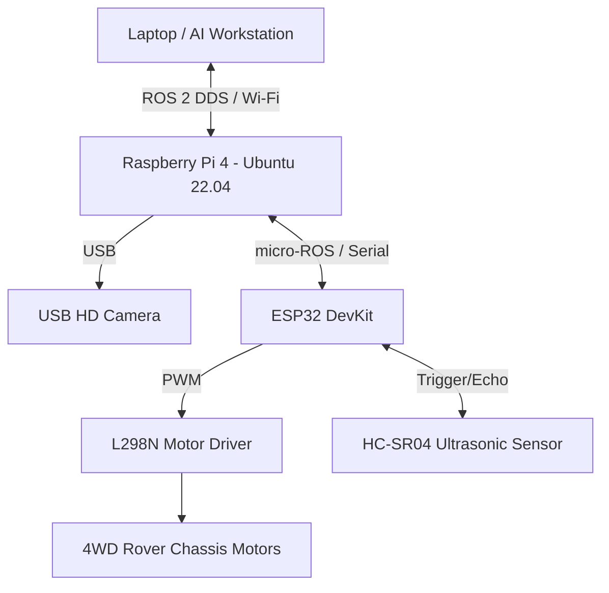

# BUILDScan Rover
**AI-Assisted ROS 2-Based Mobile Robotic System for Indoor Structural Inspection**

## Project Objective
BUILDScan Rover is a physical ROS 2-based mobile robotic system designed for automated indoor structural health monitoring. It performs real-time visual inspections using AI to identify defects like cracks in indoor environments, streaming processed data to a dashboard.

## Problem Statement
Traditional structural inspections are manual, time-consuming, and potentially dangerous. BUILDScan Rover automates this process by navigating indoor structures and using deep learning on a mobile robot platform to safely detect and map defects.

---

## Current Architecture

The system utilizes a distributed ROS 2 architecture:


### Hardware Components
- **Raspberry Pi 4**: Onboard ROS 2 computer
- **Laptop**: External computational/AI workstation
- **ESP32 DevKit**: Low-level hardware controller running micro-ROS
- **USB HD Camera**: Direct image acquisition
- **L298N Motor Driver**: DC motor control
- **4WD Rover Chassis**: Mobility platform
- **HC-SR04**: Ultrasonic sensor for obstacle distance
- **Power System**: Battery and buck converter

### Software Stack
- **OS**: Ubuntu 22.04
- **Middleware**: ROS 2 Humble
- **Microcontroller Middleware**: micro-ROS
- **Perception**: YOLOv8 (Ultralytics) for crack detection

---

## ROS 2 Architecture & Package Structure

```text
ros2_ws/
└── src/
    ├── buildscan_interfaces/     # Custom MSGs, SRVs, Actions
    ├── buildscan_hardware/       # Hardware interface nodes
    ├── buildscan_perception/     # AI crack detection node
    ├── buildscan_inspection/     # Inspection state machine & reporting
    ├── buildscan_dashboard/      # Streamlit-based UI integration
    ├── buildscan_bringup/        # Launch files for entire system
    ├── buildscan_description/    # URDF / Robot definitions
    └── buildscan_navigation/     # SLAM and nav2 configurations
```

### Nodes, Topics, Services, and Actions
- **Nodes**: `camera_bridge_node`, `crack_detection_node`, `motor_interface_node`, `dashboard_node`, `inspection_manager`.
- **Core Topics**: 
  - `/cmd_vel` (Twist)
  - `/camera/image_raw` (Image)
  - `/ultrasonic_range` (Range)
  - `/inspection/result` (InspectionResult)
  - `/inspection/status` (String)
- **Services**:
  - `SetMode`
  - `SetInspectionConfig`
- **Actions**:
  - `InspectArea`

---

## Setup & Networking

### Raspberry Pi Setup
1. Install Ubuntu 22.04 LTS and ROS 2 Humble.
2. Clone this repository into your home directory.
3. Configure the USB HD camera: `chmod +x docs/setup/camera_setup.md`
4. Setup network to allow DDS discovery.

### ESP32 micro-ROS Setup
1. Open the `firmware/esp32_microros/` project in Arduino IDE.
2. Install the micro-ROS Arduino library.
3. Flash the firmware to the ESP32 DevKit.

### Laptop ROS 2 Networking
1. Ensure the Laptop and Raspberry Pi are on the same Wi-Fi network.
2. Export `ROS_DOMAIN_ID=X` on both machines to match.
3. Ping both machines to verify connection.

---

## Build & Run Instructions

### Build
```bash
cd ros2_ws
source /opt/ros/humble/setup.bash
colcon build --symlink-install
```

### Run
To launch the physical robot on the Raspberry Pi:
```bash
source install/setup.bash
ros2 launch buildscan_bringup physical.launch.py
```

To launch the AI processing and dashboard on the Laptop:
```bash
source install/setup.bash
ros2 launch buildscan_bringup laptop_ai.launch.py
```

### Testing Commands
- List packages: `ros2 pkg list | grep buildscan`
- List active nodes: `ros2 node list`
- List active topics: `ros2 topic list`
- Test motors: `ros2 topic pub /cmd_vel geometry_msgs/Twist "{linear: {x: 0.1, y: 0.0, z: 0.0}, angular: {x: 0.0, y: 0.0, z: 0.0}}"`

---

## Current Status & Future Scope

### Current Implementation Status
- Physical base is assembled with ESP32 micro-ROS integration.
- Raspberry Pi is correctly publishing raw USB camera feeds.
- The laptop successfully receives the feed, runs the YOLO segmentation model, and publishes inspection results.
- Streamlit dashboard visualizes the findings.

### Limitations
- Visual SLAM is computationally heavy on the Raspberry Pi; currently relying on remote execution.
- Indoor navigation requires stable illumination for reliable camera feed.

### Future Scope
- Implementation of LiDAR for robust obstacle avoidance.
- Autonomous path planning using `nav2` based on a predefined structural map.
- Real-time 3D reconstruction of defects.
