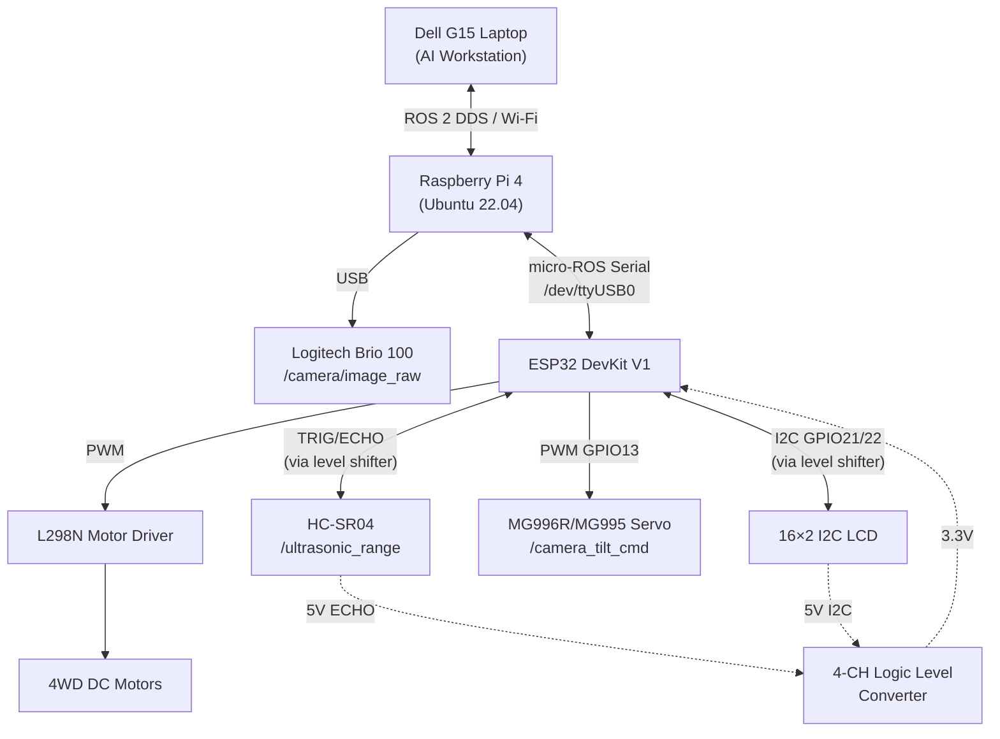

# BUILDScan Rover
**AI-Assisted ROS 2-Based Mobile Robotic System for Indoor Structural Health Inspection**

## Project Objective
BUILDScan Rover is a physical ROS 2-based mobile robotic system designed for automated indoor structural health monitoring. It performs real-time visual inspections using AI to identify defects like cracks in indoor environments, streaming processed data to a laptop dashboard.

## Problem Statement
Traditional structural inspections are manual, time-consuming, and potentially dangerous. BUILDScan Rover automates this process using a 4WD mobile robot platform with deep learning crack detection running on a dedicated AI laptop.

---

## Current Architecture



### Hardware Components (Phase A)

| Component | Role |
|-----------|------|
| **Raspberry Pi 4** | Onboard ROS 2 computer, camera host, micro-ROS agent |
| **Dell G15 Laptop** | AI workstation — YOLO inference, dashboard, inspection |
| **ESP32 DevKit V1** | Low-level hardware controller (micro-ROS) |
| **Logitech Brio 100 USB** | Camera → `/camera/image_raw` via v4l2_camera |
| **L298N Motor Driver** | DC motor control (PWM differential drive) |
| **4WD Rover Chassis** | Mobility platform (4× DC geared motors) |
| **HC-SR04 Ultrasonic** | Obstacle detection → `/ultrasonic_range` → safety stop |
| **MG996R/MG995-class Servo** | Camera tilt ← `/camera_tilt_cmd` (GPIO13) |
| **16×2 I2C LCD** | Rover status display (SDA=GPIO21, SCL=GPIO22) |
| **4-Channel Logic-Level Converter** | 5V↔3.3V: HC-SR04 ECHO + LCD I2C |
| **Power System** | Battery, buck converter, dedicated servo supply |

### Future Hardware (Phase B/C)
- 2D LiDAR (autonomous navigation)
- Rechargeable battery + holder
- Larger servo (if needed)

---

## ROS 2 Package Structure

```
ros2_ws/
└── src/
    ├── buildscan_interfaces/     # Custom MSGs, SRVs, Actions
    ├── buildscan_hardware/       # motor_interface_node, safety_node
    ├── buildscan_perception/     # crack_detection_node (YOLO)
    ├── buildscan_inspection/     # inspection_manager, report_generator
    ├── buildscan_dashboard/      # DashboardBridgeNode + Streamlit UI
    ├── buildscan_bringup/        # Launch files (Pi + Laptop separated)
    ├── buildscan_description/    # URDF / robot model
    └── buildscan_navigation/     # Nav2 config (Phase C — not yet active)
```

## ROS 2 Topics, Services, and Actions

| Type | Name | Message Type | Direction |
|------|------|-------------|-----------|
| Topic | `/cmd_vel` | `geometry_msgs/Twist` | Laptop → Pi (teleop) |
| Topic | `/cmd_vel_safe` | `geometry_msgs/Twist` | Pi → ESP32 (clamped) |
| Topic | `/ultrasonic_range` | `sensor_msgs/Range` | ESP32 → Pi → Laptop |
| Topic | `/emergency_stop` | `std_msgs/Bool` | Pi → ESP32 |
| Topic | `/camera/image_raw` | `sensor_msgs/Image` | Pi → Laptop (V4L2) |
| Topic | `/inspection/result` | `buildscan_interfaces/InspectionResult` | Laptop → dashboard |
| Topic | `/inspection/status` | `std_msgs/String` | Pi → dashboard |
| Topic | `/rover/status` | `std_msgs/String` | Pi → dashboard |
| Topic | `/camera_tilt_cmd` | `std_msgs/Float32` | Laptop → ESP32 (degrees) |
| Service | `/set_mode` | `buildscan_interfaces/SetMode` | Dashboard → Pi |
| Action | `/inspect_area` | `buildscan_interfaces/InspectArea` | Dashboard → Pi |

---

## Setup & Networking

### Raspberry Pi Setup
See [`docs/setup/pi_setup.md`](docs/setup/pi_setup.md)

### ESP32 Flashing
See [`docs/setup/flash_esp32.md`](docs/setup/flash_esp32.md)

### Network Setup (DDS / Wi-Fi)
See [`docs/setup/network_setup.md`](docs/setup/network_setup.md)

### Hardware Wiring
See [`docs/hardware/buildscan_wiring.md`](docs/hardware/buildscan_wiring.md)

---

## Build & Run Instructions

### Build (on both Pi and Laptop)
```bash
cd ~/ros2_ws
source /opt/ros/humble/setup.bash
colcon build --packages-select buildscan_interfaces   # interfaces first
source install/setup.bash
colcon build                                          # all packages
source install/setup.bash
```

### Run — Raspberry Pi (hardware side)
```bash
export ROS_DOMAIN_ID=25
export ROS_LOCALHOST_ONLY=0
ros2 launch buildscan_bringup pi_robot.launch.py
```

### Run — Laptop (AI + dashboard)
```bash
export ROS_DOMAIN_ID=25
export ROS_LOCALHOST_ONLY=0
source /opt/ros/humble/setup.bash
source ~/ros2_ws/install/setup.bash
# Launch AI inference node:
ros2 launch buildscan_bringup laptop_ai.launch.py
# Open dashboard in separate terminal:
streamlit run ~/ros2_ws/src/buildscan_dashboard/buildscan_dashboard/dashboard_node.py
```

### Testing Commands
```bash
# Verify node list
ros2 node list

# Verify topic list
ros2 topic list

# HC-SR04 sensor test
ros2 topic echo /ultrasonic_range

# Emergency stop test
ros2 topic echo /emergency_stop

# Camera tilt test
ros2 topic pub /camera_tilt_cmd std_msgs/msg/Float32 "data: 90.0"

# Motor test (very slow — verify direction first)
ros2 topic pub /cmd_vel geometry_msgs/msg/Twist \
  "{linear: {x: 0.1}, angular: {z: 0.0}}"

# Camera feed verification
ros2 topic hz /camera/image_raw

# rqt_graph (full system visualization)
rqt_graph
```

---

## Phase Status

| Feature | Status |
|---------|--------|
| Motor control + safety relay | ✅ Implemented in software |
| HC-SR04 safety stop (via ESP32 micro-ROS) | ✅ Implemented in software |
| USB camera → /camera/image_raw | ✅ Implemented in software |
| YOLO crack detection | ✅ Implemented in software |
| Inspection manager + PDF report | ✅ Implemented in software |
| Streamlit dashboard | ✅ Implemented in software |
| Camera tilt servo (/camera_tilt_cmd) | ✅ Implemented in software — not physically tested |
| I2C LCD status display | ✅ Implemented in software — not physically tested |
| Level shifter wiring | ✅ Documented — not physically validated |
| LiDAR (2D) | ❌ NOT implemented — hardware not connected |
| Autonomous navigation (Nav2/SLAM) | ❌ NOT implemented |
| Wheel odometry / encoders | ❌ NOT implemented |
